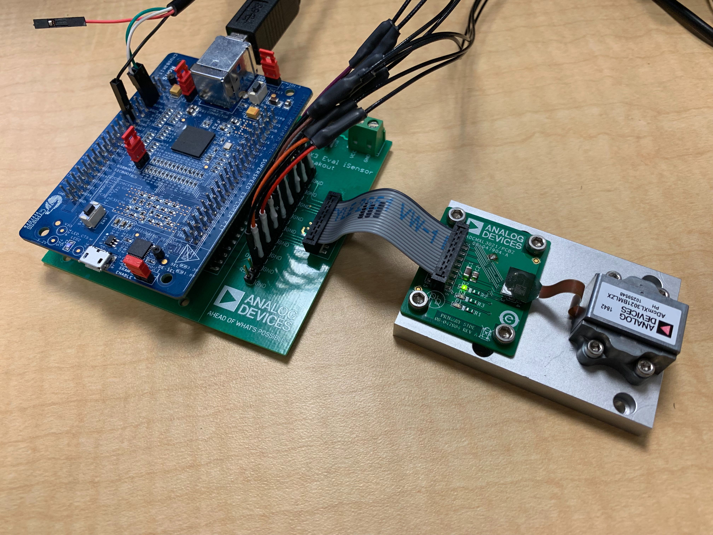
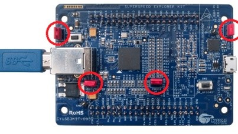

# iSensor FX3 Firmware

## Overview

The iSensor FX3 firmware provides you with a means of acquiring sensor data over a high-speed USB connection in any application that supports .NET libraries. This firmware was designed for the FX3 SuperSpeed Explorer Kit and relies on the open source libraries provided by Cypress to operate. The firmware was written using the freely-available Cypress EZ USB Suite, allowing anyone to modify the base firmware to fit their needs. 

The FX3 firmware is entirely event-driven and communicates with the PC using a vendor command structure. This event structure calls subroutines within the FX3 firmware to measure signals, configure SPI communication, acquire data, etc. This firmware also relies on the FX3Interface library to establish communication with the FX3 firmware. 

Using both the FX3 firmware and the FX3Interface libraries enables you to acquire sensor data quickly while giving the freedom to add custom features to your interface software. 

## Hardware Requirements

The firmware is designed to be built and run on a Cypress SuperSpeed Explorer Kit (CYUSB3KIT-003). A breakout board designed to convert the Explorer Kit's pins to a standard, 16-pin, 2mm connector used on most iSensor evaluation should be available soon. A schematic showing how to connect iSensor products to the Explorer Kit can be found in the Documentation folder of this repository [here](https://github.com/juchong/iSensor-FX3-Firmware/tree/master/Documentation). 

The Explorer Kit requires two jumpers to be installed before the interface library will communicate. The image below shows where the jumpers must be installed.

 

## Getting Started

To modify the firmware, the Cypress EZ USB Suite must first be installed on the target system. This repository includes an Eclipse project file that the Cypress EZ USB Suite IDE can open. 

If you would like to use the firmware (and interface library) as-is in a .NET-compatible application, the firmware image, and .dll files should be included in your project instead. An example application can be found [here](https://github.com/juchong/FX3Gui). 

## Drivers

USB drivers for the FX3 Explorer Kit should be installed automatically if the EZ USB Suite is installed. If you would like to communicate with the FX3 without installing the entire suite, the drivers are available on the ADI Wiki site [here](https://wiki.analog.com/_media/resources/eval/user-guides/inertial-mems/fx3driver.zip).

## Additional Repositories

Two additional repositories complement this firmware, the FX3Interface library containing the .NET interface software and .dlls requires to communicate with the FX3 and the example project where these libraries are implemented. Links to both of these libraries are shown below.

1. [FX3 Interface Library (FX3Interface)](https://github.com/juchong/iSensor-FX3-Interface)

2. [FX3 ADcmXL GUI Example (FX3Gui)](https://github.com/juchong/iSensor-ADcmXL-FX3Gui)

## Debugging

Debugging on the Explorer Kit is done primarily through the UART port. Unfortunately, the onboard USB debugging connector does not work using this project due to the resources required (primarily the SPI port peripheral) by the firmware. To enable debugging, you'll need to use a USB->UART adapter (like this one) to monitor GPIO 48 and 49 (labeled DQ 30 and DQ 31 on the Explorer Kit).  

## Setting Up The Build Environment

1. Download the [latest version of the FX3 SDK](http://www.cypress.com/documentation/software-and-drivers/ez-usb-fx3-software-development-kit).

2. Open the "Cypress EZ USB Suite"

3. Select "File -> Import -> Existing Project Into Workplace" and select this repository

## Supported Vendor Commands

The FX3 firmware supports several custom vendor commands used to configure the SPI interface, capture data, configure FX3 settings, etc. The vendor commands and request codes are shown below (in no particular order):

1. ADI_READ_BYTES
    * Read a word at a specified address and return the data over the control endpoint
    * Request code: 0xF0

2. ADI_WRITE_BYTE
    * Write one byte of data to a user-specified address
    * Request code: 0xF1

3. ADI_BULK_REGISTER_TRANSFER
    * Return data over a bulk endpoint before a bulk read/write operation
    * Request code: 0xF2

4. ADI_FIRMWARE_ID_CHECK
    * Return FX3 firmware ID
    * Request code: 0xB0

5. ADI_FIRMWARE_RESET
    * Reset the FX3 firmware
    * Request code: 0xB1

6. ADI_SET_SPI_CONFIG
    * Set FX3 SPI configuration
    * Request code: 0xB2

7. ADI_READ_SPI_CONFIG
    * Return FX3 SPI configuration
    * Request code: 0xB3

8. ADI_GET_STATUS
    * Return the current status of the FX3 firmware
    * Request code: 0xB4

9. ADI_READ_PIN
    * Read the value of a user-specified GPIO
    * Request code: 0xC3

10. ADI_STREAM_REALTIME
    * Start or stop a real-time stream
    * Request code: 0xD0

11. ADI_NULL_COMMAND
    * Do nothing (default case)
    * Request code: 0xD1

12. ADI_READ_TIMER_VALUE
    * Read the current FX3 timer register value
    * Request code: 0xC4

13. ADI_PULSE_DRIVE
    * Drive a user-specified GPIO for a user-specified time
    * Request code: 0xC5

14. ADI_PULSE_WAIT
    * Wait for a user-specified pin to reach a user-specified level (with timeout)
    * Request code: 0xC6

15. ADI_SET_PIN
    * Drive a user-specified GPIO
    * Request code: 0xC7

16. ADI_MEASURE_DR
    * Measure the pulse frequency (used for data ready) on a user-specified pin
    * Request code: 0xC8

17. ADI_STREAM_GENERIC_DATA
    * Start or stop a generic data stream
    * Request code: 0xC0
